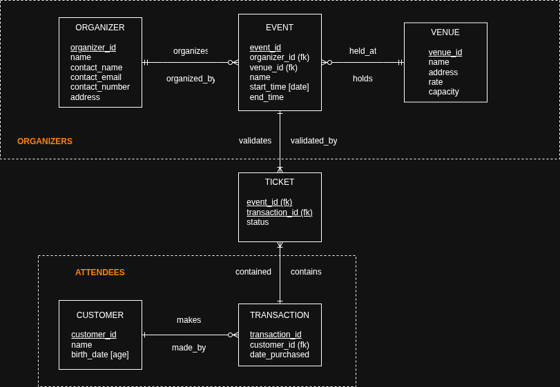

### Background

This project is loosely based on the *Central Bookings* final project case for the course CSCI 41 (Information Management) at Ateneo de Manila University.

It has been independently reimplemented and extended as a portfolio project.

### Features (needs rewrite! write for HR not the engineer)
- Implementation of CRUD operations.
- Session and authentication.
- Role-based access and views.

### Technologies
- Frontend
  - HTML
  - CSS
  - JavaScript
- Backend
  - PHP
- Database
  - PostgreSQL

### Database Design

The database is designed around the lifecycle of an event booking system. Organizers create events that are scheduled at venues, while customers
purchase tickets through transactions. Ticket ownership is separated from purchase records to support booking management and events analytics.

The ERD below illustrates the core entities and their relationships.

